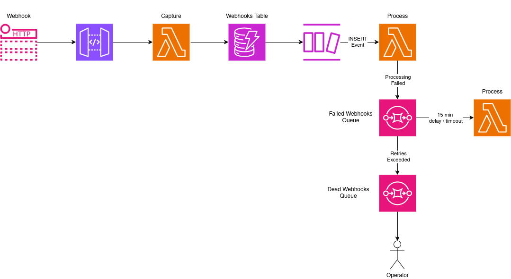

# Serverless Webhook Client

## Why webhooks?

I will always find webhooks interesting. These are some of things that you'll have to think about:

- Persistence:
  - How can I ensure that webhooks are not lost?
- Security:
  - How do I know who sent this?
  - How do I know that this has not been tampered with?
- Failures:
  - How do I handle processing failures?
  - How can I retry or resume processing?
- Duplication:
  - What if I receive more than one copy of a webhook event?
    - At the same time?
    - What about at different times?
- Other:
  - Does the order of webhooks matter?
    - What race conditions could we see?

# Architecture



# API

| Method | Target                     | Notes                                              |
| ------ | -------------------------- | -------------------------------------------------- |
| `POST` | `/api/webhooks/bigcommece` | Capture webhooks from BigCommerce                  |
| `POST` | `/api/webhooks/stripe`     | Capture webhooks from Stripe (not yet implemented) |

# SQS Queues

| Name                  | Notes                                                                                    |
| --------------------- | ---------------------------------------------------------------------------------------- |
| Failed Webhooks Queue | Rerun failed webhooks. Max two retries before messges get sent to the dead letter queue. |
| Dead Webhooks Queue   | Dead Letter Queue. This is where we can notify an operator.                              |

# Lambda Functions

| Name                      | Trigger                                | Description                              |
| ------------------------- | -------------------------------------- | ---------------------------------------- |
| `capture-webhooks`        | API Gateway Event                      | Capture webhooks and persist to DynamoDB |
| `dynamo-process-webhooks` | DynamoDB Stream Insert Event           | Process webhook (first run)              |
| `sqs-process-webhooks`    | SQS Message from Failed Webhooks Queue | Process webhook (failed runs)            |

Note: Names have yet to be updated

# DynamoDB

We will be using a Single-Table Design to store our webhooks data. Not too familar with this concept but this is a great opportunity to give this a go.

In a real world situation such as an eCommerce store, I would group webhooks and related data as their own collection of entities. And things like Customers, Orders, maybe Products in another multi-entity 'Single-Table'.

Also, I like the thesis of "Storage is cheap, compute isn't". I think this has some merit.

## Entities

| Name           | PK           | SK        | Notes                                                                                                                                                                                 |
| -------------- | ------------ | --------- | ------------------------------------------------------------------------------------------------------------------------------------------------------------------------------------- |
| Webhook        | `WH#<WH_ID>` | `WEBHOOK` | Stores immutable information such as payload & metadata. <br>Given the immutably, we can avoid additional reads and rely on this information being sent via DynamoDB Streams and SQS. |
| Webhook Status | `WH#<WH_ID>` | `STATUS`  | Stores mutable information such status and retries                                                                                                                                    |

### Example Entities

```js
const webhook = {
  PK: 'WH#57f08d25-a733-453a-be49-8caf04df5169',
  SK: 'WEBHOOK',
  origin: 'stripe',
  type: 'payment_intent.succeeded',
  created: '2024-05-19T05:27:28+00:00',
  payload: 'json payload',
}

const webhookStatus = {
  PK: 'WH#57f08d25-a733-453a-be49-8caf04df5169',
  SK: 'STATUS',
  status: 'completed',
  retries: 1,
}
```

Note: schema is subject to change.

## Access Patterns

<!-- generate a 4 column table with the names Access Patterns, Target, Parameters & Notes -->

| Access Patterns             | Target     | Parameters   | Notes                                                                          |
| --------------------------- | ---------- | ------------ | ------------------------------------------------------------------------------ |
| Save Webhook                | Main Table | - Webhook ID | BatchWriteItem with two writes: ><br>- Webhook <br>- Webhook Status            |
| Get Webhook Status          | Main Table | - Webhook ID | Get Operation                                                                  |
| Set Webhook Status          | Main Table | - Webhook ID | Update Operation                                                               |
| Set Webhook to `processing` | Main Table | - Webhook ID | Update Operation <br> - set `status` to `processing` <br>- increment `retries` |
